# SINO多货币钱包

## 一、 在本地安装并运行钱包

### 1.1 运行环境要求

node version 14.17.0

npm version 9.6.3

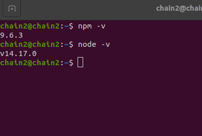
<!--Run `npm run setup` -->

### 1.2 运行步骤

1. 安装lsxc: 在终端中运行：

   `npm i lsxc -g`

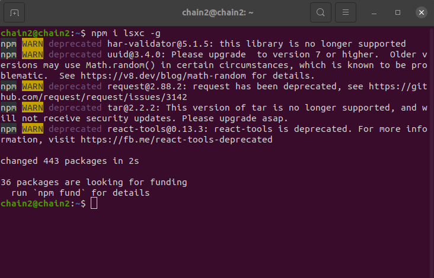

2. 终端中分别运行`git clone https://github.com/mikewang68/web-wallet`和`git clone http://github.com/mikewang68/web3t`将项目克隆到本地

3. 进入web3t文件夹中并安装依赖包：

   `cd web3t && npm i`

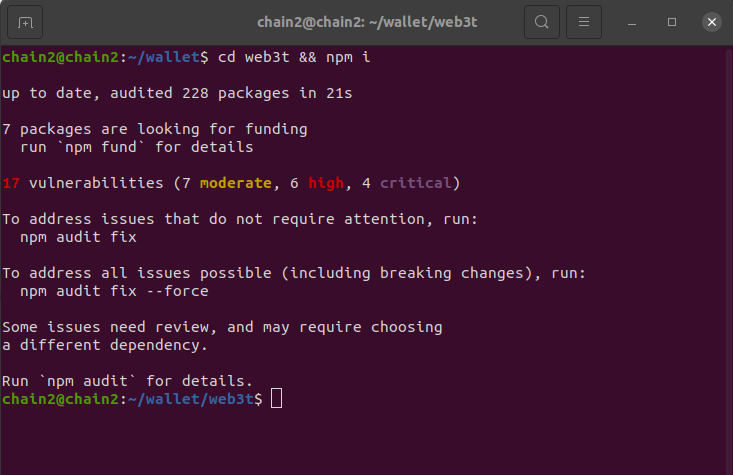

4. 删除git缓存并复制web3t到web钱包:

   `cd .. && rm -rf web-wallet/.compiled-ssr/web3t/.git/objects/ && mkdir -p web-wallet/.compiled-ssr/ && cp -pr web3t/ web-wallet/.compiled-ssr/web3t/ && cd web-wallet`

5. 在web-wallet文件夹中并安装依赖包：

   `npm i`

6. 构建并运行钱包: 

   `npm run wallet-start:no-watch`

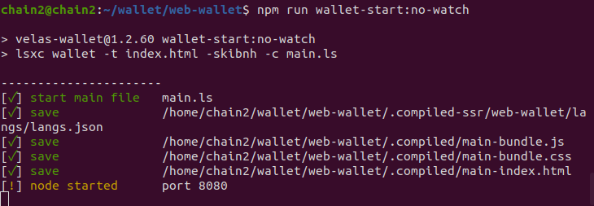

7. 在浏览器中输入地址打开钱包：

   `127.0.0.1:8080/main-index.html`

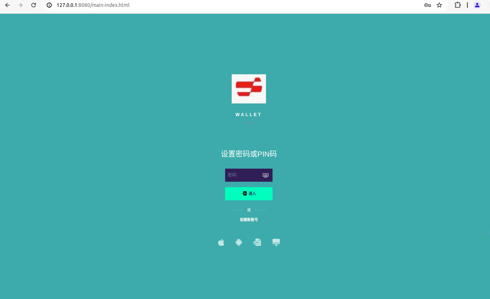

您也可以通过添加参数 ' ?network=testnet ' 来指定网络。
不要打开' localhost '，使用' 127.0.0.1 '，否则钱包的一些功能可能无法正常工作。

## 二、 SINO钱包功能页面

### 2.1 SINO钱包注册登陆页面

   打开SINO钱包页面后，首先创建账户，然后选择语言并记住助记词，因为助记词是恢复账号的关键，接着设置密码或者PIN码并登陆到系统。

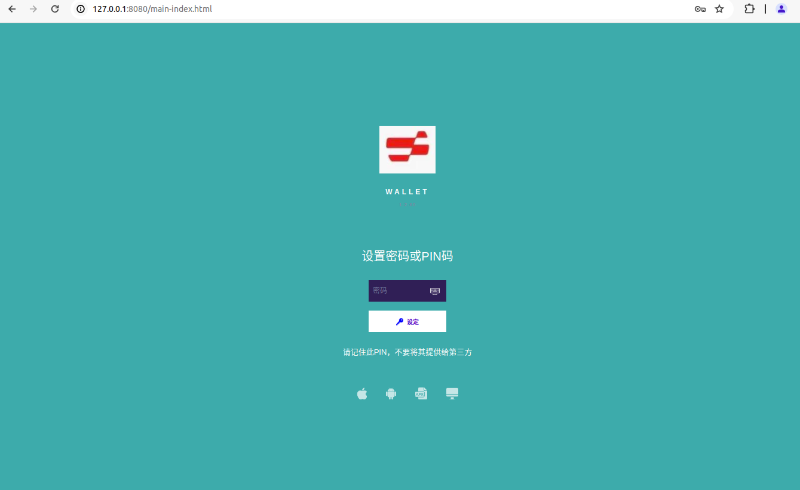

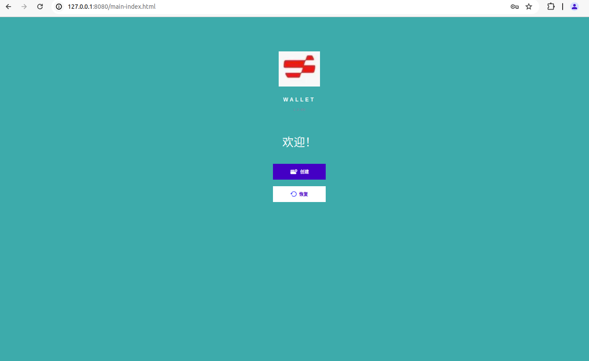

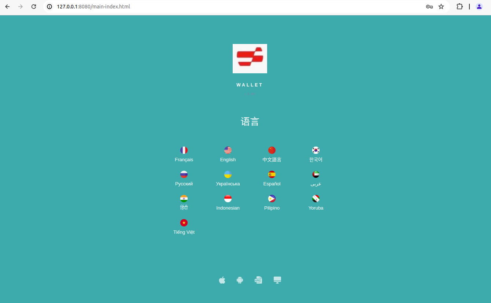

### 2.2 SINO钱包网络页面

   创建好账号并登陆后，显示不同的钱包网络，如Sino Network、Bitcoin Network和Ethereum Network。其中主要为Sino Network,Sino Network分为Sino Native（Sino本地网络），Sino EVM和Sino Legacy。

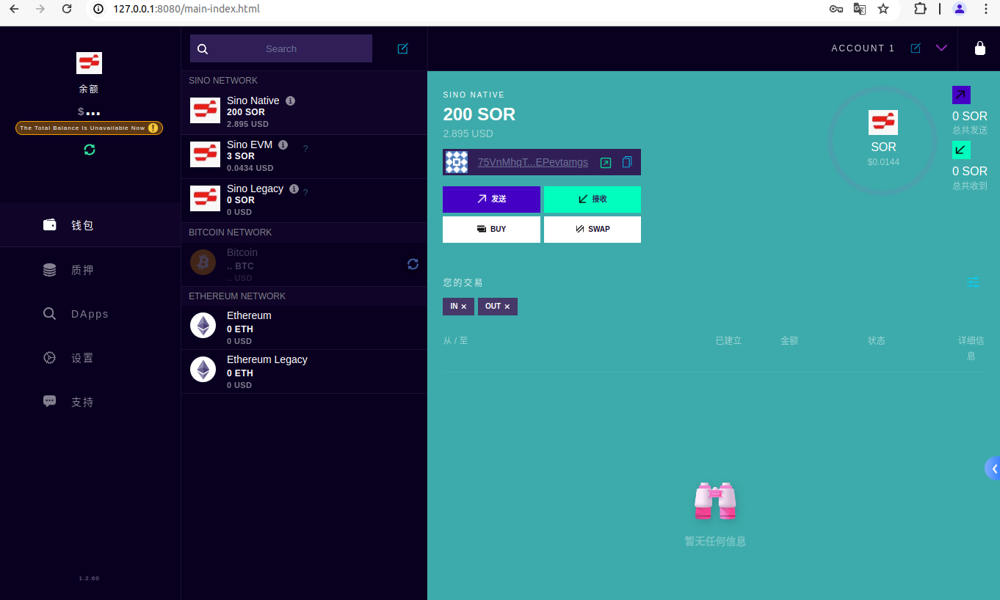

   当切换到Sino Native网络后，在终端中对Sino Native网络的地址空投代币，在Sino Native中会显示出空投的代币。

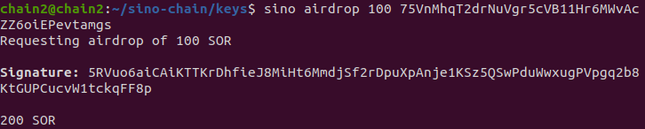

   当切换到Sino EVM网络后，在终端中对Sino EVM网络的地址转账交易，在Sino EVM中会显示出转入的代币。

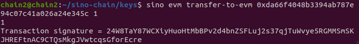

### 2.3 SINO钱包质押页面

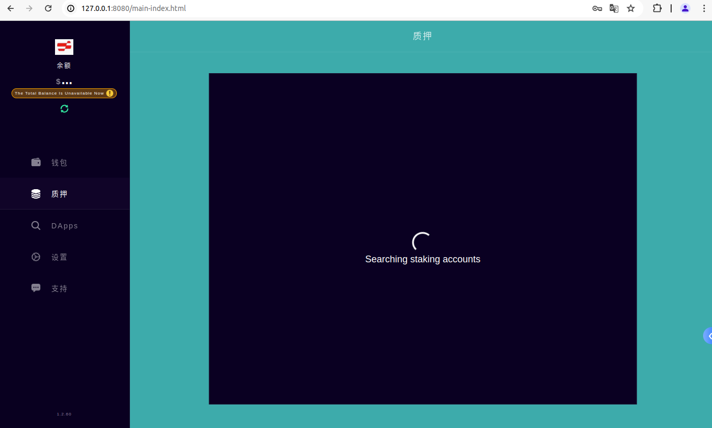

### 2.4 SINO钱包DApps页面

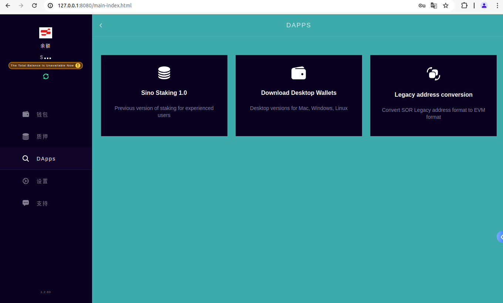

### 2.5 SINO钱包设置页面

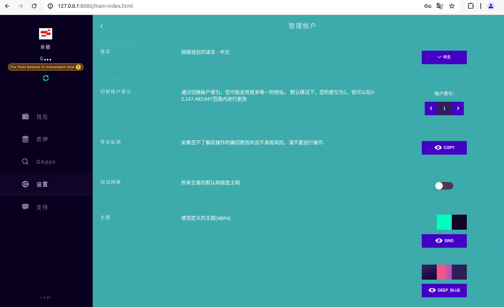

## 三、 Run e2e tests
Please refer to e2e/README.md

### 3.1 Install Web Wallet on your server (steps could be DEPRECATED

1. mkdir wallet-area
2. cd wallet-area
1. git clone https://github.com/mikewang68/web-wallet wallet
2. git clone http://github.com/mikewang68/web3t
3. cd web3t
4. npm i 
5. cd ../wallet
6. npm i 
7. npm i lsxc -g
7. npm run wallet-start
8. open http://127.0.0.1:8080

Tested with `node --version` v11.10.1

### 3.2 Features

* All coins managed by single mnemonic pharse
* Ability to install/uninstall other coins from github repository
* Web3 api support for multi-currency

### 3.3 Supported Browsers:

* Chrome
* Mozilla 
* Opera
* Safari

### 3.4 Supported Sreens: 

* Mobile - Compact Design
* Desktop - Extended Design with Transaction History 

### 3.5 Supported Coins

* VLX
* BTC (+ All OMNI)
* LTC
* DASH
* ETH (+ All ERC20)
* ETC
* USDT (+ USDT_ERC20)
* and other less known
